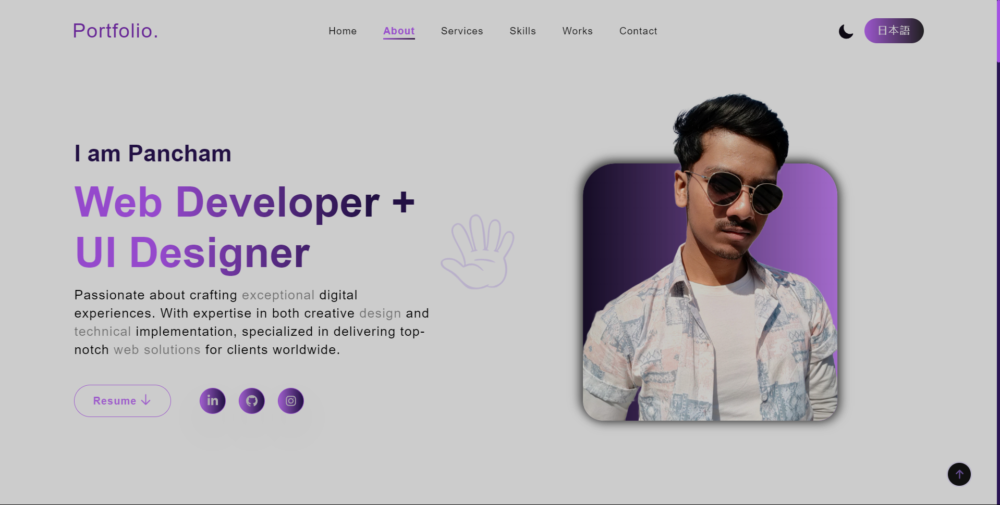

# Pancham Sardar's Portfolio

Welcome to my personal portfolio website! This site is a showcase of my skills, projects, and professional journey as a web developer and UI designer.

## 🖼️ Preview

## 🛠️ Technologies Used

- **Frontend:** HTML, CSS, JavaScript, React, Tailwind CSS
- **Backend:** Node.js, Express.js
- **Tools & Libraries:** Git, Webpack, Framer Motion, React Icons, i18next

## 🌟 Features

- **Responsive Design:** Optimized for viewing on all devices, from desktops to mobile phones.
- **Multi-Language Support:** The portfolio supports multiple languages, enhancing accessibility.
- **Interactive Animations:** Smooth transitions and animations using Framer Motion.
- **Project Showcase:** A dedicated section for displaying my projects, with detailed descriptions and links to live demos.

## 📂 Project Overview

The portfolio is divided into several sections:

- **Home:** Introduction to who I am and what I do.
- **About:** My background, education, and professional interests.
- **Achievements:** My certifications and recognitions.
- **Skills:** Technologies and tools I specialize in.
- **Works:** A showcase of my recent projects, categorized by type.
- **Services:** The services I offer, including UI design, web app development, and backend development.
- **Contact:** A section to get in touch with me via email or phone.

## 🌐 Live Demo

You can view the live portfolio here: [pancham-portfolio.netlify.app](https://pancham-portfolio.netlify.app/)

## 🙌 Connect with Me

- **LinkedIn:** [Pancham Sardar](https://www.linkedin.com/in/pancham-sardar-6a466227b/)
- **Medium:** [@PanchamSardar](https://medium.com/@PanchamSardar)

Thank you for visiting my portfolio! Feel free to reach out if you'd like to collaborate or learn more about my work.
